# Sitemap & Arquitetura de Informação — STUW Luxury Activewear

---

## 1. Visão Geral da Estrutura

Baseado na convergência dos líderes mundiais (**Alo Yoga**, **Lululemon**, **On Running** e **Gymshark**), o sitemap da **Stuw** foi desenhado com base em 3 princípios essenciais do e-commerce de luxo moderno:

1. **Jornada Híbrida de Descoberta:** A cliente de alto padrão compra por **Categoria** (ex: leggings), por **Sensação/Tecido** (*The Science of Feel* de Lululemon) ou por **Ocasião/Lifestyle** (*Studio-to-Street* da Alo Yoga).
2. **Eliminação de Fricção (Regra dos 3 Cliques):** Nenhuma peça do catálogo deve estar a mais de 3 cliques da página inicial.
3. **Atendimento VIP Integrado:** O concierge de personal shopping e o guia de biotipos são incorporados de forma orgânica em toda a navegação.

```mermaid
graph TD
    Home["🏠 HOME (Experiência Imersiva Cinematográfica)"]

    %% Menus Principais
    Home --> NavNovidades["1. LANÇAMENTOS & CÁPSULAS"]
    Home --> NavRoupas["2. VESTUÁRIO (Por Categoria)"]
    Home --> NavSensorial["3. O TOQUE STUW (Por Tecido / Feel)"]
    Home --> NavOcasiao["4. STUDIO-TO-STREET (Por Ocasião)"]
    Home --> NavAcessorios["5. ACESSÓRIOS & WELLNESS"]
    Home --> NavUniverso["6. UNIVERSO STUW (Manifesto & Club)"]

    %% Sub-rotas Lançamentos
    NavNovidades --> Nov1["New Arrivals (Drops Semanais)"]
    NavNovidades --> Nov2["Cápsula Sazonal (Ex: SilkAir / Earth Mineral)"]
    NavNovidades --> Nov3["Ícones & Best Sellers"]
    NavNovidades --> Nov4["Lookbook Editorial da Coleção"]

    %% Sub-rotas Vestuário
    NavRoupas --> R1["Leggings & Calças (Sculpt, Flare, Cós Alto)"]
    NavRoupas --> R2["Tops & Sutiãs de Alta Sustentação"]
    NavRoupas --> R3["Bodies & Macacões (Onesies)"]
    NavRoupas --> R4["Casacos, Jaquetas & Alfaiataria Esportiva"]
    NavRoupas --> R5["Shorts & Saias (Tennis Skirt, Biker)"]
    NavRoupas --> R6["Segunda Pele, Regatas & Knitwear"]

    %% Sub-rotas Sensoriais
    NavSensorial --> S1["Tecido SilkAir™ (Toque Seda & Ultraleve)"]
    NavSensorial --> S2["Tecido SculptHold™ (Alta Compressão Anatômica)"]
    NavSensorial --> S3["Tecido VelvetNulu™ (Toque Pele de Pêssego / Maciez)"]
    NavSensorial --> S4["Tecido ShieldAir™ (Corta-vento Térmico & UV50+)"]

    %% Sub-rotas Ocasião
    NavOcasiao --> O1["Studio & Mindful (Yoga, Pilates, Barre)"]
    NavOcasiao --> O2["High Impact (Running, HIIT, Musculação)"]
    NavOcasiao --> O3["Racquet & Club (Tennis, Pickleball, Golfe)"]
    NavOcasiao --> O4["Street & Travel (Aeroporto, Alfaiataria, Brunch)"]
    NavOcasiao --> O5["Recovery & Lounge (Pós-treino, Descanso)"]

    %% Sub-rotas Acessórios
    NavAcessorios --> A1["Gym Bags, Totes & Mochilas de Luxo"]
    NavAcessorios --> A2["Meias Técnicas de Compressão & Faixas"]
    NavAcessorios --> A3["Bonés & Viseiras Minimalistas"]
    NavAcessorios --> A4["Mats de Borracha Natural & Blocos de Cortiça"]
    NavAcessorios --> A5["Wellness Care (Glow Mist, Aromas de Estúdio)"]

    %% Sub-rotas Universo
    NavUniverso --> U1["Manifesto & Sustentabilidade das Fibras"]
    NavUniverso --> U2["Stuw Privé Club (Programa VIP & Fidelidade)"]
    NavUniverso --> U3["Guia de Caimento & Provador Inteligente"]
    NavUniverso --> U4["Concierge VIP & Personal Shopper (WhatsApp)"]
```



---

## 2. Mapa Detalhado das Páginas (Estrutura de URLs & UX)

### 2.1. Header & Menu Principal (Navegação Global)

```
STUW (Header Fixo Glassmorphism)
│
├── 1. LANÇAMENTOS (/lancamentos)
│   ├── Ver Todos os Lançamentos (/lancamentos/todos)
│   ├── Cápsula da Estação: SilkAir 2026 (/colecoes/silkair)
│   ├── Edições Limitadas (/colecoes/edicao-limitada)
│   ├── Best Sellers da Marca (/colecoes/best-sellers)
│   └── Editorial / Campanha Fotográfica (/campanha/lookbook)
│
├── 2. VESTUÁRIO (/vestuario)
│   ├── Leggings (/vestuario/leggings)
│   │   ├── Alta Compressão (Sculpt)
│   │   ├── Cós Alto Anatômico
│   │   ├── Modelagem Flare & Pantalona
│   │   └── Sem Costura (Seamless)
│   ├── Tops & Sutiãs (/vestuario/tops)
│   │   ├── Suporte Leve (Yoga & Pilates)
│   │   ├── Suporte Médio (Treino Diário)
│   │   └── Alto Suporte (Corrida & Alto Impacto)
│   ├── Bodies & Macacões (/vestuario/macacoes-bodies)
│   ├── Casacos & Jaquetas (/vestuario/jaquetas-casacos)
│   │   ├── Corta-vento Térmico
│   │   ├── Jaquetas Bomber de Alfaiataria
│   │   └── Cardigans & Trench Coats Esportivos
│   ├── Shorts & Bermudas Bikers (/vestuario/shorts)
│   ├── Saias Esportivas & Tennis (/vestuario/saias)
│   ├── Blusas, Regatas & Segunda Pele (/vestuario/blusas-segunda-pele)
│   └── Knitwear & Lounge Luxo (/vestuario/lounge-tricot)
│
├── 3. O TOQUE STUW — Por Tecido & Sensação (/tecnologia-sensorial)
│   ├── O que é a Ciência do Toque Stuw? (/tecnologia-sensorial/manifesto)
│   ├── Linha SilkAir™ (Toque seda, 0.08mm, respirável) (/linhas/silkair)
│   ├── Linha SculptHold™ (Modelagem corporal, cós duplo, zero transparência) (/linhas/sculpthold)
│   ├── Linha VelvetNulu™ (Toque pele de pêssego amanteigado) (/linhas/velvetnulu)
│   └── Linha ThermoShield™ (Proteção térmica, repelente à água e UV50+) (/linhas/thermoshield)
│
├── 4. STUDIO-TO-STREET — Por Atividade & Ocasião (/lifestyle)
│   ├── Studio & Mindful: Yoga, Pilates & Barre (/lifestyle/studio-mindful)
│   ├── High Energy: Running, Musculação & Funcional (/lifestyle/high-energy)
│   ├── Racquet Club: Tennis & Beach Tennis (/lifestyle/racquet-club)
│   ├── Street & Travel: Do Treino ao Voo / Reunião (/lifestyle/street-travel)
│   └── Rest & Sanctuary: Descanso & Autocuidado (/lifestyle/rest-sanctuary)
│
├── 5. ACESSÓRIOS & BEM-ESTAR (/acessorios)
│   ├── Bolsas, Gym Bags & Nécessaires (/acessorios/bolsas-totes)
│   ├── Meias Técnicas & Compressão (/acessorios/meias)
│   ├── Bonés, Viseiras & Scrunchies (/acessorios/acessorios-cabelo)
│   ├── Equipamentos de Luxo: Mats & Blocos (/acessorios/equipamentos)
│   └── Linha Wellness & Aromaterapia (/acessorios/wellness-care)
│
└── 6. O UNIVERSO STUW (/universo)
    ├── Nossa Filosofia & Origem (/universo/sobre)
    ├── Sustentabilidade & Rastreabilidade das Fibras (/universo/sustentabilidade)
    ├── Stuw Privé Club (Benefícios VIP) (/universo/prive-club)
    ├── Provador Virtual & Guia de Medidas (/universo/guia-de-tamanhos)
    └── Concierge de Personal Shopping (/universo/concierge)
```

---

### 2.2. Páginas do Funil de Conversão (Core E-Commerce)

1. **PLP (Product Listing Page / Catálogo):**
   * URL: `/colecoes/{nome-da-colecao}` ou `/vestuario/{categoria}`
   * *Elementos Chave:*
     * Alternador de grade (2 colunas editoriais amplas vs 4 colunas de catálogo rápido).
     * Barra de filtros de luxo: **Nível de Compressão (1 a 4)**, **Sensação do Tecido**, **Ocasião**, **Cor (Amostras minerais)** e **Tamanho**.
     * Badge de status: *"Edição Limitada"*, *"Toque Seda"*, *"Alta Compressão"*.
     * Microinteração de *hover-to-cycle* (visão 360° ou macro da fibra).
     * Botão flutuante de seleção rápida de tamanho (*Quick Add*).

2. **PDP (Product Detail Page / Página do Produto):**
   * URL: `/produto/{slug-do-produto}`
   * *Elementos Chave:*
     * Layout Split-Screen com fotos em alta definição 3:4 e vídeo curto da modelo em movimento.
     * Macro-zoom da trama do tecido em escala 1:1.
     * Painel de Fibras & Sensação: Nível de compressão, elasticidade 4-way, respirabilidade e sensação na pele.
     * Provador interativo: recomendação por altura, peso e caimento desejado (justo, modelador ou relaxado).
     * Seletor de cores com o nome oficial gravado (ex: *Obsidian Black*, *Sage Olive*, *Cashmere Dune*).
     * Seção *"Complete the Look"* integrada com compra combinada em 1 clique.
     * Prova social detalhada: avaliações com fotos reais e biotipo das compradoras.

3. **Slide-Cart Drawer (Sacola Flutuante):**
   * Acionado instantaneamente após o clique em *"Adicionar à Sacola"*.
   * Barra de metas: *"Faltam R$ X para Frete Expresso Cortesia"*.
   * Cross-sell de baixo atrito (ex: par de meias técnicas ou scrunchie de seda).
   * Botão direto para Checkout sem etapas intermediárias desnecessárias.

4. **Checkout Transparente de Alta Conversão:**
   * URL: `/checkout`
   * Checkout One-Page sem distrações ou menus.
   * Pagamento em 1 toque: Apple Pay, Google Pay, Pix com QR Code dinâmico e Cartão de Crédito em até 6x sem juros.
   * Opção de "Embalagem para Presente de Luxo" (caixa rígida com fita e aroma exclusivo de boas-vindas).

5. **Área da Cliente: Stuw Privé Lounge:**
   * URL: `/conta`
   * `/conta/pedidos` — Rastreamento minucioso do envio em tempo real.
   * `/conta/favoritos` — Lista de desejos (*Wishlist* de luxo).
   * `/conta/medidas` — Perfil de biotipo salvo para recomendar tamanhos automaticamente.
   * `/conta/beneficios` — Extrato de pontos e mimos exclusivos do Stuw Privé.

---

### 2.3. Rodapé Institucional & Páginas de Suporte (Footer)

```
RODAPÉ (Footer)
│
├── ATENDIMENTO EXCLUSIVO
│   ├── Concierge WhatsApp (Personal Shopper dedicado)
│   ├── Central de Ajuda & FAQ
│   ├── Solicitar Troca ou Devolução (Logística Reversa Cortesia)
│   └── Guia de Cuidados com as Peças (Lavagem & Conservação de Tecidos Técnicos)
│
├── O UNIVERSO STUW
│   ├── Manifesto da Marca
│   ├── Compromisso com o Planeta & Fibras Sustentáveis
│   ├── Stuw Privé Club
│   └── Espaços Físicos & Parcerias com Studios de Yoga/Pilates
│
├── PRIVACIDADE & SEGURANÇA
│   ├── Política de Privacidade (LGPD)
│   ├── Termos e Condições de Compra
│   └── Certificados de Segurança SSL & Pagamento Seguro
│
└── NEWSLETTER PRIVÉ
    └── Convite exclusivo para pré-venda de novos drops e eventos fechados de bem-estar.
```

---

## 3. Por que este Sitemap Converte Mais?

| Característica | O que os Concorrentes Ensinaram | Como a Stuw Aplica no Sitemap |
| :--- | :--- | :--- |
| **3 Portas de Entrada para o Produto** | Clientes da Alo buscam pelo visual; da Lululemon pelo toque; da On pela precisão. | A Stuw permite navegar por **Categoria**, por **Sensação/Tecido** ou por **Ocasião de Uso**, cobrindo os 3 perfis de compradora. |
| **Destaque para o Tecido Técnico** | A Lululemon construiu um império de bilhões de dólares ensinando nomes de tecidos (*Align Nulu*, *Wunder Train*). | A Stuw tem uma seção exclusiva no menu para suas tecnologias de tecido (*SilkAir™*, *SculptHold™*), justificando o ticket alto. |
| **Menos Cliques até o Carrinho** | A Gymshark é mestra em evitar que a usuária se perca em subpáginas antes de comprar. | Uso de *Quick Add* e *Side-Cart Drawer* que mantém a navegação sem refresh. |
| **Sensação de Clube de Luxo** | Alo e On não vendem só roupas; vendem uma entrada para um clube de mulheres elegantes e saudáveis. | Presença do *Stuw Privé Club* e do *Concierge VIP*, elevando a marca da categoria de "loja" para "grife de bem-estar". |
