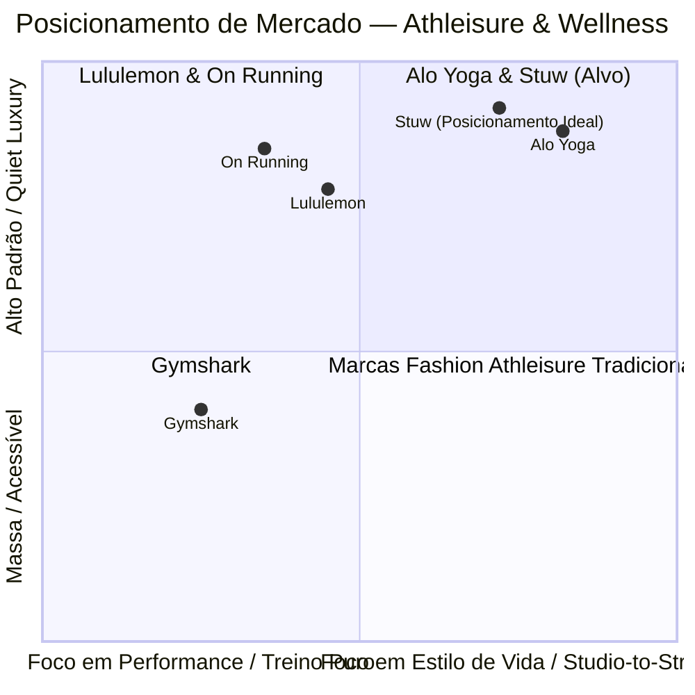

# Stuw Activewear & Wellness — Estudo Competitivo & Design System de Luxo

---

## 1. Mapeamento dos Concorrentes de Mercado

Análise aprofundada dos quatro gigantes do segmento encontrados na pasta de referências: **Alo Yoga**, **Lululemon**, **On Running** e **Gymshark**.

---

### 1.1. Alo Yoga
* **Branding:** "Studio-to-Street", mindfulness, comunidade aspiracional de celebridades (Kendall Jenner, Hailey Bieber). É a marca do *glow*, da estética limpa, da ioga como símbolo de status e alta sociedade.
* **Posicionamento:** Luxo contemporâneo, moda com propósito e autocuidado. Preço premium justificado pela exclusividade, estética de passarela e apelo influenciador global.
* **Design:** 
  * Layout editorial minimalista com bastante respiro (white space).
  * Monocromático de base com paletas sazonais limitadas (capsule drops).
  * Fotografia solar, iluminada, com peles hidratadas, cenários arquitetônicos de concreto aparente, areia e estúdios banhados por luz natural.
  * Tipografia: Wordmark geométrico em minúsculas e corpo em **Proxima Nova**.
* **Conceito Chave:** *Mindful Movement & Elevated Living*. A roupa esportiva transcende a academia e se torna o uniforme diário da mulher moderna de alto poder aquisitivo.
* **Ponto Forte Digital:** Apresentação tipo revista (*magazine layout*), onde a compra parece uma curadoria estética e não um catálogo puramente transacional.

---

### 1.2. Lululemon
* **Branding:** "The Science of Feel". O pioneiro e benchmark histórico de activewear técnico premium. Foco no equilíbrio entre corpo, mente e comunidade ("Sweatlife").
* **Posicionamento:** Luxo técnico e funcional. O produto justifica seu preço pelo toque da fibra (*Align Nulu fabric*), costuras milimétricas e durabilidade extrema.
* **Design:**
  * Interface ultra-limpa e funcional, com fundo branco puro e contraste cirúrgico.
  * Tipografia mestre: **Calibre** (Klim Type Foundry) combinada a fontes editoriais de manifesto (**SangBleu Empire**, **Messina Modern**, **Druk**).
  * PDP (Product Detail Page) orientada a dados sensoriais: peso do tecido, nível de compressão, respirabilidade e fit anatômico.
* **Conceito Chave:** *Sensory Performance*. O tecido não deve restringir; deve parecer uma extensão da pele.
* **Ponto Forte Digital:** Microinteração de *hover-to-cycle* nas fotos do catálogo, filtros técnicos avançados e prova social sólida (avaliações detalhadas com biotipo da compradora).

---

### 1.3. On Running (On)
* **Branding:** Engenharia suíça, precisão biomecânica, sustentabilidade e sofisticação arquitetônica. Colaborações de prestígio (ex: Loewe, Zendaya, Roger Federer).
* **Posicionamento:** *High-Performance Luxury*. A marca que une corredores de elite à alta-costura internacional.
* **Design:**
  * Estilo Tipográfico Internacional Suíço (Swiss Style).
  * Tipografia sob medida (**On Diatype**, customizada pela Dinamo Typefaces), transmitindo ar moderno, suave e preciso.
  * Grids modulares assimétricos, blocos esculturais, estética quase de galeria de arte.
  * Paleta essencialmente preta e branca com toques minerais e fluorescentes funcionais.
* **Conceito Chave:** *Ignite the Human Spirit Through Movement / Swiss Engineering*. Sensação de leveza absoluta ("correr nas nuvens").
* **Ponto Forte Digital:** Narrativa tecnológica e minimalismo radical. Cada pixel transmite solidez, precisão e qualidade industrial sem nenhum ruído visual.

---

### 1.4. Gymshark
* **Branding:** "Be a visionary". Hiper-comunitário, atlético, motivacional, nascido na cultura digital e do fitness intenso.
* **Posicionamento:** Performance e treino muscular direto. Embora tenha apelo de massa e ticket médio mais acessível que as outras três, é a líder incontestável em conversão digital (DTC - Direct-To-Consumer).
* **Design:**
  * Tipografia bold condensada, geométrica e enérgica (estilo Bebas / Montserrat / Heavy Sans).
  * Layout escuro/alto contraste, muito focado na visualização tridimensional da anatomia e musculatura com tecidos sem costura (*seamless*).
  * Menus dinâmicos, checkout ultra-rápido, ribbons de escassez e tags de urgência.
* **Conceito Chave:** *Conditioning*. Esculpir o corpo, superar limites físicos, pertencer a uma comunidade fitness.
* **Ponto Forte Digital:** Engenharia de conversão: seleção rápida de tamanhos, drawer cart impecável, vídeos curtos em loop mostrando caimento em movimento.

---

## 2. Pontos de Convergência e Fatores de Sucesso

Cruzando as 4 marcas de maior sucesso mundial, identificamos a fórmula que atrai o público feminino de alto padrão:

| Fator de Sucesso | Como os Melhores Aplicam | Aplicação para a Stuw |
| :--- | :--- | :--- |
| **Canvas Neutro & Silencioso** | Alo, Lululemon e On usam telas monocromáticas para que as roupas sejam as protagonistas absolutas. | Adotar a tendência de *Quiet Luxury*: substituir o branco frio hospitalar por um off-white mineral acolhedor (`#FBF9F5`) e preto mineral (`#131413`). |
| **A "Ciência do Toque" Visual** | Lululemon e Alo dão ênfase máxima à maciez, elasticidade e acabamento acetinado/matte do tecido nas fotos. | Fotos macro 1:1 na PDP mostrando a trama do tecido, selagem de costura e o caimento no corpo sob iluminação natural difusa. |
| **Conceito "Studio-to-Street"** | Alo Yoga transformou leggings em roupa de desfile, brunch e reuniões informais. | A Stuw deve se posicionar no lifestyle completo: da aula de pilates/yoga até o almoço social ou viagem internacional. |
| **Tipografia Assertiva e Calma** | On com *Diatype*, Lululemon com *Calibre*, Alo com *Proxima Nova* e formas suaves. | Nada de fontes genéricas de e-commerce padrão. Usar uma combinação de neo-grotesca refinada com uma serifa de alta costura em títulos de campanhas. |
| **Microinterações Imperceptíveis ("Digital Cashmere")** | Transições de hover suaves, drawer cart dinâmico sem reload, troca instantânea de foto pela bolinha de cor. | Navegação fluida a 60fps com curva física suave (`cubic-bezier(0.16, 1, 0.3, 1)`), eliminando qualquer sensação de site pesado ou truncado. |

---

## 3. Identidade & Design System Oficial da Stuw

Para capturar e encantar o mesmo público exigente da Alo Yoga e Lululemon, com a sofisticação da On e a velocidade de compra da Gymshark, criamos a arquitetura de design da **Stuw**.

---

### 3.1. A Paleta de Cores: *Earthy Mineral & Quiet Luxury*

O luxo contemporâneo de 2026 aboliu o alto contraste artificial de preto 100% puro (`#000`) e branco 100% puro (`#FFF`). O olhar desse público busca serenidade, materiais nobres e tons táteis inspirados na natureza, linho, seda e minerais.

* **Primary / Obsidian Mineral (`#131413`)**: Um preto mineral profundo, aveludado e com micro-matiz carvão orgânico. Transmite autoridade sem a dureza do `#000000`. Usado em botões principais, tipografia de destaque e logomarca.
* **Canvas / Cloud Silk (`#FBF9F5`)**: Off-white com subtom quente que reduz o cansaço visual e simula a sensação de papéis artesanais de luxo ou seda pura.
* **Surface / Warm Sandstone (`#EFECE5`)**: Fundo para cards de produto, blocos de depoimentos e drawers secundários. Dá profundidade tátil sem criar bordas pesadas.
* **Wellness Accent / Sage Botanical (`#586255`)**: Verde sálvia refinado, inspirado em plantas medicinais, folhas secas e estúdios de yoga orgânicos. Utilizado para badges de lançamentos, selos de sustentabilidade e pontos de foco conscientes.
* **Luxury Accent / Cashmere Champagne (`#B8A28E`)**: Dourado/terracota acinzentado sutil para detalhes como estrelas de avaliação, linhas de destaque e tags "Edição Limitada".
* **Subtle Border (`#E5E0D7`)**: Cinza quente ultra-sutil de 1px com transparência para contornar cards e campos sem poluir o visual.

---

### 3.2. Tipografia (A Escolha da Fonte Perfeita)

A identidade tipográfica da Stuw une a **precisão funcional** da On Running com a **elegância editorial** da Vogue e Alo Yoga.

#### Nível 1: Headlines & Storytelling Editorial (A Alma da Marca)
* **Fonte Recomendada:** **Cormorant Garamond** (Google Fonts) ou **IvyPresto / SangBleu** (Licenciada).
* **Uso:** Frases de manifesto, banners da coleção, títulos de campanhas da home e citações de bem-estar.
* **Estilo:** Itálico leve ou Roman Médio, com espaçamento equilibrado. Exemplo: *"A precisão do movimento. O luxo da pausa."*

#### Nível 2: Interface, Catálogo, Botões & PDP (Engenharia de Conversão)
* **Fonte Recomendada:** **Plus Jakarta Sans** (Google Fonts, moderna, limpa e com curvas geométricas que lembram a On Diatype e a Calibre) ou **PP Neue Montreal** (Licenciada).
* **Uso:** Nomes de produtos, menu de navegação, seletores de tamanho, preços, descrições técnicas e carrinho.
* **Pesos:**
  * Regular (400) para parágrafos e descrições.
  * Medium (500) para links e categorias.
  * Semi-Bold (600) para preços e botões de conversão ("Adicionar à Sacola").

---

### 3.3. Arquitetura do Layout do E-commerce (UX/UI de Alta Conversão)

1. **Header Flutuante Translúcido (Glassmorphism 16px):**
   * Altura esbelta (64px), fixo com efeito de vidro fosco no scroll (`backdrop-filter: blur(20px); background: rgba(251, 249, 245, 0.88)`).
   * Logomarca **STUW** centralizada com tipografia geométrica pura e espaçamento generoso (`letter-spacing: 0.25em`).

2. **Hero Section Cinematográfica:**
   * Proporção 16:9 full-bleed, fotografia solar em luz natural difusa.
   * Headline em serifa elegante: *"A precisão do movimento. O luxo da pausa."*
   * Botão primário elegante em formato pílula com cantos suavemente lapidados.

3. **Grade de Produtos (Catálogo / PLP):**
   * Proporção de imagem **3:4** (formato editorial de moda vertical).
   * Alternador de visualização: **2 Colunas** (foco editorial e detalhes de styling) ou **4 Colunas** (compras rápidas).
   * Hover-to-cycle com revelação da parte traseira ou close de fibra.
   * Swatches interativos de cores que alternam a foto sem refresh.

4. **Página de Detalhes do Produto (PDP):**
   * Galeria Split-Screen: fotos verticais sequenciais com zoom macro e painel de compra fixo (*sticky*).
   * Painel 'Sensory & Performance Specs': nível de compressão, toque do tecido, respirabilidade, proteção UV50+ e sustentabilidade.
   * Guia de tamanhos inteligente interativo.

5. **Side-Cart Drawer Flutuante:**
   * Desliza suavemente pela direita ao adicionar um item sem tirar a usuária da navegação.
   * Barra de progresso para frete cortesia e cross-sell de acessórios essenciais (meias técnicas, scrunchies, bonés).

---

### 3.4. Efeitos e Microinterações ("The Luxury Sensation")

1. **Curvas de Aceleração Física:** `cubic-bezier(0.16, 1, 0.3, 1)` com duração de `350ms` a `500ms`, garantindo resposta fluida como seda.
2. **Hover Preview com Fade Cruzado (200ms):** Transição suave entre look frontal e close de costura.
3. **Cursor Magnético Sutil:** Micro-atração em direção ao ponteiro nos botões primários.
4. **Scroll Reveal & Parallax Difuso:** Elementos entram na tela com elevação vertical sutil de `20px`.
5. **Vidro Fosco sem Sombras Pesadas:** Bordas de 1px com transparência (`rgba(0,0,0, 0.05)`) em vez de sombras escuras artificiais.
6. **Haptic Feedback Visual:** Micro-contração tátil de 0.98x na escala do botão ao clicar em "Comprar".

---

## 4. O Diferencial Único da Stuw (A Fusão do Melhor de Cada Um)

| Concorrente | O que a Stuw absorve e refina |
| :--- | :--- |
| **Alo Yoga** | A aura aspiracional, o status de celebridade e o lifestyle *Studio-to-Street*. |
| **Lululemon** | A credibilidade científica, o toque sensorial (*Science of Feel*) e a prova social minuciosa. |
| **On Running** | O rigor arquitetônico suíço, o minimalismo radical e a tipografia moderna impecável. |
| **Gymshark** | A engenharia de conversão: checkout rápido, navegação mobile-first e seleção sem atrito. |

Essa fusão posiciona a **Stuw** no epicentro do mercado de luxo de bem-estar feminino, oferecendo uma experiência que transmite prestígio, conforto incomparável e confiança imediata.
